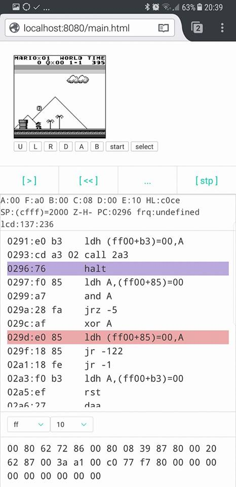

# GBCoffee

A GameBoy emulator written in Coffeescript and developped mostly on my smartphone with Termux &#x2764; during traffic jams in Geneva.

This is still a WIP but it can run some games like Tetris, Super Mario Land or Zelda. Additionally, it contains a basic integrated debugger.

You can compile to JS with `cake build`. If you want the debugger enabled, compile with `cake -d build` then use `debug.html` instead of `main.html`

Sound is disabled by default because it's just too buggy for now:

gb.coffee
```js
    @timer.update cycles
    @lcd.update cycles
    # @audio.update cycles
```



Of course you will need a basic http server like `http-server`
