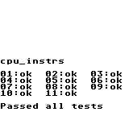
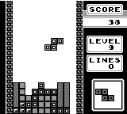
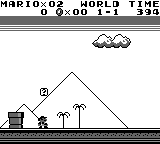

This is my second emulator and most of the steps were identical to what I did when I created an NES emulator. Therefore, I decided to write some lines about the chronological process. Maybe no one will find it interesting, but I will certainly reuse this for my next one.


## Memory

The first thing you will need is a memory object. This is basically a class that contains a private array of unsigned integers and public read/write functions. You may also need a `read_word` and a `write_word` function, especially if you are dealing with a big-endian system.

Because of the complexity of some memory areas, like mirroring, memory registers, read only areas or unusable sections, I recommend to create routing tables. This is just two arrays `read_map` and `write_map`, where keys are memory addresses and values are pointers to specialized read/write functions. It will have a cost only when building the arrays during the initialization phase of your emulator:

```coffee
# building read_map & write_map
for a in [0..0x10000]

  # rom bank 0 - fixed home
  if a < 0x4000
    @_read_map[a] = 'rom_read'

    # enable/disable ext ram
    if a < 0x2000
      @_write_map[a] = 'enable_disable_ext_ram'

    # select rom bank nb
    else if a < 0x4000
      @_write_map[a] = 'select_bank_lo'

  # switchable rom bank - home
  else if a < 0x8000
    @_read_map[a] = 'rom_bank_read'

  etc...
```

You can use these two arrays in your public read/write functions. This will avoid conditional code during execution.

```coffee
# main read memory function
r: (i) -> @[@_read_map[i & 0xffff]] i
```

Here is the stack trace of the `read()` function of the memory object:
```
read(address) -> routing_table[address](address) = specialized_read(address) -> mapper_specialized_read(address) -> return RAM/ROM[address]
```


The last thing that is needed regarding memory is the creation of Memory Bank Controllers. I recommend the creation of individual classes for each controller implementation. You should instantiate a new controller object when reading the identifier byte (0x147) from the game file, then give this object to your memory object and use it in your read/write functions. This will avoid dependencies between your classes and it will facilitate the implementation of new controllers. You should have at least the MBC1 implemented.

### ROM loader

The second thing you should implement is the ROM loader. Keep it outside the memory class, reading a binary file has nothing to do with memory. Pass the ROM array to your memory class once it's loaded.

### CPU

Now that you have a loaded ROM in memory, you can focus on CPU implementation. This is not very difficult but this is the main source of bugs.

Basically it's just a class that has a main `update()` function that is called continuously from the emulator main loop. This function reads a byte in memory (opcode) at the location that is saved in the PC register, and then it calls the corresponding CPU operation. It may read parameters in memory at location PC+1 and PC+2 if needed. The PC register is incremented by one or two, depending of the number of parameters provided. The CPU has one PC register, four flags (F register), four 8-bit/16-bit internal registers and a 16-bit stack pointer.

```coffee
# main CPU loop
update: ->
  @cc = 0

  # read opcode
  opc = @mem.r @PC

  # get func & args from routing table
  [func, p1, p2] = @op[opc]

  # increment PC
  @PC++

  # execute
  # each operation increments PC
  @[func] p1, p2

  # sum cycles
  @cc += @cycles[opc]

  # return cycles
  @cc
```

For a fast implementation, it's better to create some routing tables (opcodes -> function pointers). The GameBoy z80 has two opcode tables, one for standard operations and one for secondary operations (0xCB codes). The NES has only one table with 256 entries.

```coffee
# CPU routing table
@op =
  0x00: ['nop']
  0x01: ['ld_rr_nn', 'BC']
  0x02: ['ld_rri_r', 'BC', 'A']
  0x03: ['inc_rr', 'BC']
  0x04: ['inc_r', 'B']
  0x05: ['dec_r', 'B']
  0x06: ['ld_r_n', 'B']
  0x07: ['rlca']
  0x08: ['ld_nni_rr', 'SP']
  ...
```

About implementing the CPU registers, the cool thing with Javascript or Python is the possibility to create class properties with custom getters and setters. This is very helpful with 8/16 bit registers:

```coffee
Function::prop = (p, d) -> Object.defineProperty @::, p, d

@prop 'HL',
  get: -> (@H << 8) | @L
  set: (v) ->
    @H = (v >> 8) & 0xff
    @L = v & 0xff
```

The custom z80 version of the GB has only four internal flags: zero, negative, half-carry and carry. They are stored in the four upper bits of the F register. You will need to keep this in mind when implementing the tricky DAA operation.

Note that there's no need to implement all opcodes for now; simply trap the unimplemented operations in logs so you can build your CPU step-by-step.

There's one important thing to build now is the interrupt system: in emulator main loop, check whether "IF register" (IRQ) and "IE register" (interrupt on/off flags) are both enabled, then push PC on stack, and jump to the interrupt vector.

```coffee
# interrupt request
# it sets the corresponding request flag
irq: (intid) ->
  irq = @mem.r 0xff0f
  irq |= (1 << intid)
  @mem.w 0xff0f, irq

# interruption
interrupt: (intid) ->

  # turn off global status
  @int_status = false

  # reset request flag
  @mem.w 0xff0f, @mem.r 0xff0f & ~intid

  # location of jump vectors
  vectors =
    0b00001: 0x40
    0b00010: 0x48
    0b00100: 0x50
    0b01000: 0x58
    0b10000: 0x60

  # push PC to stack
  @SP = (@SP - 2) & 0xffff
  @mem.w @SP, @PC & 0xff
  @mem.w @SP+1, (@PC>> 8) & 0xff

  # jump to the interrupt vector
  @PC = vectors[intid]
```

A final note about CPU. Don't forget to count clock cycles. It is important for correct LCD/CPU synchronization. My personal preference is to create a lookup table (opcode => cycles) so I can get the correct number of cycles in the main CPU loop `@cc += @cycles[opc]`.

### LCD/PPU

Now it's time for the fun part - when you finally see something.

LCD or PPU are finite state machines. For GB, start with a class and a single method `update(cpu_cycles)` that gets the number of CPU cycles as a parameter. Focus on that function, and create all the conditional code that is needed during a scanline to address each of the possible states of the LCD status register (0xff41) at the correct cycle time. Be sure that your LCD/CPU are correctly synchronized before doing any functional coding. You will need to request the VBLANK and LCD STAT interrupts on time.

In pseudo code, the main logic could be something similar to:
```
update: (cpu_cycles) ->

  if lcd is on then add cpu_cycles to lcd_cycles
  else set lcd_cycles = 0, set scanline = 0 (0xff44), set LCD mode = 0 then exit

  if scanline is in visible area (< 144)
    if lcd_cycles < 80
      set LCD mode = 2
    else if lcd_cycles < 252
      set LCD mode = 3
    else
      set LCD mode = 0
  else
    LCD mode = 1

  if mode changed and mode irq flag is set then LCD interrupt

  if scanline is equal to Y value of coincidence (0xff45)
    set coincidence flag (bit 2) in LCD status register
    if coincidence irq flag is set (bit 6) then LCD interrupt
  else
    reset coincidence flag to zero

  if end of scanline (HBLANK, lcd_cycles >= 456)

    reset lcd_cycles to zero and increment scanline

    if scanline = 144 then request a VBLANK interrupt and set VBLANK flag
    else if scanline in visible area (< 144) then render the line (bg+sprites)
    else if scanline greater than 153 (last scanline is done) then reset scanline

```

If you create the emulator with Javascript or another interpreted language, a "pixel perfect" emulation will certainly be too slow. I recommend counting the remaining CPU cycles that are needed for one scanline (456 CPU cycles) and then drawing the entire line at once after resetting the cycle counter. Create a `render_scanline` method which contains two sub-methods: `render_background` and `render_sprites`. There's no need to implement the sprite rendering yet; it's not used by test ROMS.


### Blargg testing ROMS

Now, it's time for intensive debugging. Load individual `cpu_instrs` files, and try to pass all the tests. You may need to implement a debugger or at least a trace log. If your CPU disobeys, jump to the asm source code of the corresponding test; it will help in finding what's wrong with your CPU.

Finally, as a victory and to see the famous screen, run the ROM that contains all the tests: `cpu_instrs.gb`. You will need the MBC1 mapper to make it works correctly.



### Tetris, sprites and joypad

Everywhere on the internet you'll find that the simplest game to emulate is Tetris. This is because the code is very clear, it doesn't require a memory controller and you can find the full game disassembly commented on Github. While all of this is true, you will also need a correct Joypad implementation otherwise you'll be stuck on the title screen. The best way I've found to emulate the joypad register is to create an 8-bit internal variable, in which each bit contains the press/release status of a single button. Then you can do something similar to the following (in Coffeescript):

```coffee
joypad: (k, pressed) ->
  # k = 0:right, 1:left, 2:up, 3:down, 4:A, 5:B, 6:select, 7:start
  # four upper bits are directional, four lower are buttons
  if pressed
    @joypad_status &= 0xff ^ (1 << k)
  else
    @joypad_status |= (1 << k)
```

The joypad register is inverted: 0 means pressed/selected while 1 means released/unselected.

When reading this memory location, you will need to check whether the game is requesting button status or directional pad status (bits 4-5, 0x10 = buttons, 0x20 = directional) then build the register value accordingly.

```coffee
stat = @ram_read 0xff00
if stat & 0x10
  0xc0 | (stat & 0x30) | (@gb.joypad_status >> 4)
else
  0xc0 | (stat & 0x30) | (@gb.joypad_status & 0xf)
```
The two upper bits 6-7 are not used and are set to 1 (0xc0).

You should be able to run the game but without sprites it will not be very fun. I recommend to go back to your LCD class and to make the sprite implementation now.



### Timer

If you are able to run Tetris, next comes the timer and Super Mario Land. Timer is easy to implement and it's needed in SML to regularly trigger the timer CPU interrupt.

Create a class that contains a single method `update(cpu_cycles)` and read the frequency in register 0xff07. Increment the two counters (0xff04/0xff05) when the timer reaches the total number of cycles needed for that frequency. Reset the timer, 0xff05, with the modulator value stored at 0xff06 when it reaches 255, and request a timer interrupt at this time. The divider timer (0xff04) will be incremented every 256 CPU cycles and should be reset to zero.

Possible frequencies (CPU cycles before next increment) are 1024, 16, 64, 256. This is controlled by bits 0-1 of register 0xff07.



### Sound

...